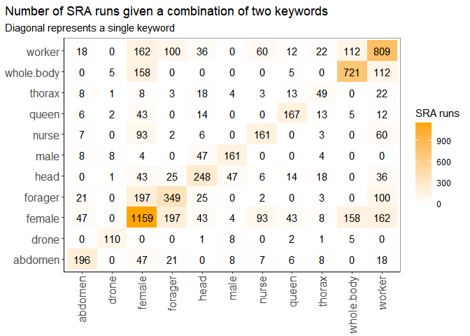
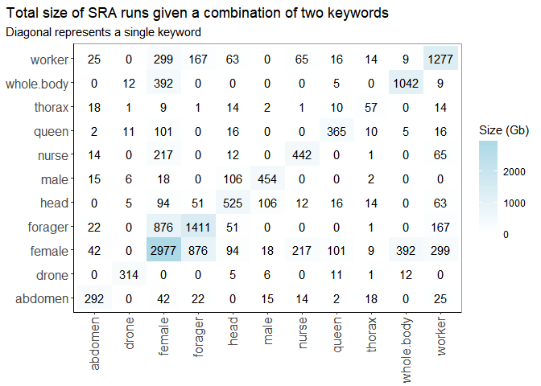

Find bee SRA runs from metadata
================
Blake Paget
2025

## Background

RNA-Seq data will be analysed to determine the expression pattern of an
uncharacterised protein. The Sequence Read Archive (SRA) maintained by
NCBI will be used. The metadata will be searched for appropriate runs.
In a separate publication selected runs will be downloaded and
analysed.<br>

“SRA has deposited its metadata into BigQuery to provide the
bioinformatics community with programmatic access to this data. You can
now search across the entire SRA by sequencing methodologies and sample
attributes.”<br>

A simple SQL query will be used to retrieve a table for further analysis
in R. The sample attributes are an inconsistent mess and rather than
trying to sort that with complex SQL queries, I’ll just use R.

## Script

#### Load libraries

``` r
library(tidyverse)
library(bigrquery)
library(dotenv)
library(ggplot2)
```

<br>

#### Import csv from BigQuery

``` r
# Use environment variables to mask private data.
load_dot_env()

# Read the csv bq table if available, otherwise redo the SQL query.
df <- try(read.csv("bquxjob_722b10fc_1971e82ea0f.csv"))
if (inherits(df, "try-error")) {
  # BigQeury SQL query
  query <-
    "
    SELECT *
    FROM `nih-sra-datastore.sra.metadata`
    WHERE
      organism = 'Apis mellifera' AND
      consent = 'public' AND
      assay_type = 'RNA-Seq'
    "
  tb <- bq_project_query(Sys.getenv("BIGQUERY_PROJECT"), query)
  df <- bq_table_download(tb)
}
```

<br>

#### Data cleaning

``` r
glimpse(df)
```

    ## Rows: 4,692
    ## Columns: 37
    ## $ acc                                 <chr> "SRR7770436", "SRR22681164", "SRR6…
    ## $ assay_type                          <chr> "RNA-Seq", "RNA-Seq", "RNA-Seq", "…
    ## $ center_name                         <chr> "GEO", "ZHEJIANG UNIVERSITY OF TEC…
    ## $ consent                             <chr> "public", "public", "public", "pub…
    ## $ experiment                          <chr> "SRX4626009", "SRX18643300", "SRX3…
    ## $ sample_name                         <chr> "GSM3362362", "R-TRZ-2", "RNA109_P…
    ## $ instrument                          <chr> "Illumina HiSeq 4000", "Illumina N…
    ## $ librarylayout                       <chr> "PAIRED", "PAIRED", "PAIRED", "SIN…
    ## $ libraryselection                    <chr> "cDNA", "Oligo-dT", "RANDOM", "cDN…
    ## $ librarysource                       <chr> "TRANSCRIPTOMIC", "TRANSCRIPTOMIC"…
    ## $ platform                            <chr> "ILLUMINA", "ILLUMINA", "ILLUMINA"…
    ## $ sample_acc                          <chr> "SRS3727542", "SRS16088054", "SRS2…
    ## $ biosample                           <chr> "SAMN09937971", "SAMN32035609", "S…
    ## $ organism                            <chr> "Apis mellifera", "Apis mellifera"…
    ## $ sra_study                           <chr> "SRP159176", "SRP412451", "SRP1307…
    ## $ releasedate                         <chr> "2019-10-31 00:00:00.000000 UTC", …
    ## $ bioproject                          <chr> "PRJNA488619", "PRJNA908448", "PRJ…
    ## $ mbytes                              <int> 6041, 2127, 2302, 336, 2082, 3246,…
    ## $ loaddate                            <lgl> NA, NA, NA, NA, NA, NA, NA, NA, NA…
    ## $ avgspotlen                          <int> 300, 300, 302, 100, 302, 302, 150,…
    ## $ mbases                              <int> 15048, 6976, 6517, 1081, 4952, 100…
    ## $ insertsize                          <lgl> NA, NA, NA, NA, NA, NA, NA, NA, NA…
    ## $ library_name                        <chr> "", "R-TRZ-2", "112_S9_L001_R1_001…
    ## $ biosamplemodel_sam                  <chr> "[]", "[Model organism or animal]"…
    ## $ collection_date_sam                 <chr> "", "", "2015-08-10", "", "2013-07…
    ## $ geo_loc_name_country_calc           <chr> "", "", "USA", "", "USA", "", "", …
    ## $ geo_loc_name_country_continent_calc <chr> "", "", "North America", "", "Nort…
    ## $ geo_loc_name_sam                    <chr> "[]", "[]", "[USA: NC]", "[]", "[U…
    ## $ ena_first_public_run                <chr> "[]", "[]", "[]", "[]", "[]", "[]"…
    ## $ ena_last_update_run                 <chr> "[]", "[]", "[]", "[]", "[]", "[]"…
    ## $ sample_name_sam                     <chr> "[]", "[]", "[]", "[]", "[]", "[]"…
    ## $ datastore_filetype                  <chr> "[fastq,run.zq,sra]", "[fastq,run.…
    ## $ datastore_provider                  <chr> "[gs,ncbi,s3]", "[gs,ncbi,s3]", "[…
    ## $ datastore_region                    <chr> "[gs.us-east1,ncbi.public,s3.us-ea…
    ## $ attributes                          <chr> "{\n  \"attributes\": [{\n    \"k\…
    ## $ run_file_version                    <int> 1, 1, 1, 1, 1, 1, 1, 1, 1, 1, 1, 1…
    ## $ jattr                               <chr> "{\"geo_accession_exp\": [\"GSM336…

``` r
# Any NA rows for primary key 'acc'?
is.na(df$acc) %>% table()
```

    ## .
    ## FALSE 
    ##  4692

``` r
# Check file sizes.
is.na(df$mbytes) %>% table()
```

    ## .
    ## FALSE 
    ##  4692

``` r
max(df$mbytes)
```

    ## [1] 39732

``` r
min(df$mbytes)
```

    ## [1] 0

``` r
# What entries have 0 Mb?
df %>%
  filter(mbytes == 0) %>% 
  group_by(bioproject) %>% 
  count()
```

    ## # A tibble: 1 × 2
    ## # Groups:   bioproject [1]
    ##   bioproject      n
    ##   <chr>       <int>
    ## 1 PRJNA477521    30

``` r
df %>% 
  filter(bioproject == "PRJNA477521") %>% 
  select(acc, mbases, mbytes, library_name) %>% 
  glimpse
```

    ## Rows: 90
    ## Columns: 4
    ## $ acc          <chr> "SRR7412438", "SRR7412505", "SRR7412478", "SRR7412457", "…
    ## $ mbases       <int> 0, 46, 63, 0, 33, 40, 0, 57, 61, 36, 0, 0, 55, 43, 0, 0, …
    ## $ mbytes       <int> 0, 24, 33, 0, 17, 21, 0, 31, 33, 19, 0, 0, 29, 23, 0, 0, …
    ## $ library_name <chr> "2016_3_THI_d", "2017_3_GLY_b", "2017_4_GLY_f", "2016_1_C…

``` r
# One bioproject with samples with blank reads? Remove from list.
df <-
  df %>% 
  filter(mbytes != 0)

nrow(df)
```

    ## [1] 4662

``` r
# Looks like the 'attributes' and 'jattr' are nested as JSON objects. 
# Not shown here, I have extracted these and compared them.
# These each contain the same sample info, e.g. 'tissue_sam_ss_dpl145': 'thoracic muscle'.
# Expand 'jattr' and add it to the df. Drop 'jattr' and 'attributes' nested columns.
```

``` r
library(jsonlite)
```

``` r
parsed_jattr <- lapply(df$jattr, fromJSON)
jattr_tibble <- 
  lapply(parsed_jattr, function(x) { 
    t(cbind(names(x), as.character(unname(x))))
  }) %>% 
  lapply(function(x) {
    z <- as.data.frame(x[-1, ])
    row.names(z) <- x[1, ]
    as.data.frame(t(z))
  }) %>% 
  do.call(plyr::rbind.fill, .) %>% 
  as_tibble

jattr_df <- as_tibble(cbind(df[, !names(df) %in% c("attributes", "jattr")], jattr_tibble), .name_repair = "unique")
```

    ## New names:
    ## • `collection_date_sam` -> `collection_date_sam...25`
    ## • `collection_date_sam` -> `collection_date_sam...49`

<br>

#### Data analysis

I’m interested in sectioning the RNA-seq data by caste and large body
structure initially. The keywords to look for across the expanded table
are listed in the code chunk below.<br>

``` r
# Get only the character columns.
df_chr <-
  jattr_df %>% 
  select(where(is.character))
```

``` r
# Define keywords. Note "whole.body" is used so regex searches for any character none or more times in between
# the two words.
keywords <- c("female", "male", "drone", "queen", "worker", "nurse", "forager", "whole.body", "head", "thorax", "abdomen")
keywords <- sort(keywords)

# Grep each row of the table for the keyword, producing a list of all columns
# with the row number under the column the keyword appeared in.
# Count the number of row indices for each column (length).
keyword_list <- list()
for (keyword in keywords) {
  keyword_list[keyword] <- 
      as_tibble(sapply(df_chr, function(x) { grep(keyword, x, ignore.case = T)}) %>%
        lapply(., length) %>%
        unlist)
}

# Tidy.
keyword_find <- as.data.frame(do.call(rbind, keyword_list))
names(keyword_find) <- names(df_chr)
keyword_find <- keyword_find[ , colSums(keyword_find) != 0]
ncol(keyword_find) # the keywords appear in this many columns of the expanded metadata.
```

    ## [1] 36

<br>

The table below gives the number of times any keyword appears in a
column, there are 34 columns in total.

``` r
# Summary of keyword spread.
data.frame(freq = sort(colSums(keyword_find), decreasing = T)) # most frequent columns
```

    ##                                  freq
    ## sex_calc                         2339
    ## tissue_sam_ss_dpl145             1202
    ## caste_sam                         477
    ## isolate_sam_ss_dpl100             443
    ## source_name_sam                   419
    ## sample_name                       412
    ## dev_stage_sam                     374
    ## library_name                      182
    ## age_sam                           151
    ## sample_type_sam_ss_dpl131          99
    ## group_sam                          88
    ## isolation_source_sam               56
    ## tissue_exp                         49
    ## sex_type_sam                       48
    ## developmental_stage_sam            40
    ## altitude_sam_s_dpl11               32
    ## treatment_sam_ss_dpl55             28
    ## individual_sam                     24
    ## primary_search                     21
    ## tissue_type_sam_s_dpl410           20
    ## host_tissue_sampled_sam_s_dpl239   17
    ## sample_name_sam                    15
    ## body_part_sam                      15
    ## experimental_factor__caste_exp     14
    ## submitter_id_sam                   14
    ## bee_type_sam                       12
    ## behavioural_type_sam               12
    ## phenotype_sam                      11
    ## social_caste_sam                    9
    ## center_name                         7
    ## breed_sam                           5
    ## development_stage_sam               4
    ## behavioral_state_sam                4
    ## infected_with_sam                   3
    ## comment_sam                         2
    ## geo_loc_name_sam                    1

<br>

Ideally I want to find SRA runs that are clearly defined by caste:tissue
or sex:tissue. This can be achieved by using grep and the & logical
operator. I’ll see whats available with all two-keyword
combinations.<br>

``` r
# All combinations (x2) of keywords with replacement and distinct items.
key_key <- arrangements::combinations(x = keywords, k = 2, replace = TRUE)

# Add word boundaries for grep so that male is not pulled from female or other unforeseen cases.
bounded_keys <- apply(t(key_key), 1, function(x) { paste0("\\b", x, "\\b") })

# Filter for both keywords, ignore case.
df_chr_searched <- apply(bounded_keys, 1, function(x) {
  jattr_df %>% 
    select(where(is.character)) %>% 
    filter(if_any(everything(), ~ grepl(x[1], ., ignore.case = T)) & if_any(everything(), ~ grepl(x[2], ., ignore.case = T)))
})
df_searched_count <- lapply(df_chr_searched, count)

# Combine keyword combinations and their counts.
key_key_count <- as.data.frame(cbind(key_key, unlist(df_searched_count)))

# Use df_chr_searched to get total size of all SRA runs for each combination.
acc <- lapply(df_chr_searched, select, acc)
df_gb_searched <- lapply(acc, function(x) {
  jattr_df %>% 
    semi_join(x, by = "acc") %>% 
    summarise(sum = sum(mbytes)) %>% 
    pull(sum)
})

# Add gb info to key_key_count table. 
key_key_count$gb <- round(unlist(df_gb_searched)/1000, digits = 0)

# Duplicate the counts for the reciprocal combinations to make the plots more readable.
recip_key_key_count <- cbind(V2 = key_key_count$V1, V1 = key_key_count$V2, V3 = key_key_count$V3, gb = key_key_count$gb)
key_key_count <- rbind(key_key_count, recip_key_key_count)
key_key_count <- key_key_count[!duplicated(key_key_count), ]
key_key_count$V3 <- as.numeric(key_key_count$V3)
key_key_count$gb <- as.numeric(key_key_count$gb)
```

<br>

#### Plot

``` r
ggplot(key_key_count, aes(V1, V2)) +
  geom_tile(aes(fill = V3)) +
  geom_text(aes(label = V3)) +
  scale_fill_gradient(low = "white",
                      high = "orange",
                      name = "SRA runs") +
  labs(title = "Number of SRA runs given a combination of two keywords",
       subtitle = "Diagonal represents a single keyword") +
  theme(axis.title = element_blank(),
        axis.text.x = element_text(angle = 90, hjust = 1, vjust = 0.4, size = 12),
        axis.text.y = element_text(size = 12),
        axis.line.x = element_line(color = "black"),
        axis.line.y = element_line(color = "black"),
        panel.grid.major = element_blank(),
        plot.caption.position = "plot",
        plot.caption = element_text(hjust = 0),
        plot.title.position = "plot",
        panel.background = element_blank(),
        panel.border = element_rect(color = "grey60", fill = NA),
        legend.position = "right",
        strip.background = element_rect(color = "grey60", fill = "white"))
```

<!-- -->

``` r
ggplot(key_key_count, aes(V1, V2)) +
  geom_tile(aes(fill = gb)) +
  geom_text(aes(label = gb)) +
  scale_fill_gradient(low = "white",
                      high = "lightblue",
                      name = "Size (Gb)") +
  labs(title = "Total size of SRA runs given a combination of two keywords",
       subtitle = "Diagonal represents a single keyword") +
  theme(axis.title = element_blank(),
        axis.text.x = element_text(angle = 90, hjust = 1, vjust = 0.4, size = 12),
        axis.text.y = element_text(size = 12),
        axis.line.x = element_line(color = "black"),
        axis.line.y = element_line(color = "black"),
        panel.grid.major = element_blank(),
        plot.caption.position = "plot",
        plot.caption = element_text(hjust = 0),
        plot.title.position = "plot",
        panel.background = element_blank(),
        panel.border = element_rect(color = "grey60", fill = NA),
        legend.position = "right",
        strip.background = element_rect(color = "grey60", fill = "white"))
```

<!-- --> <br>
